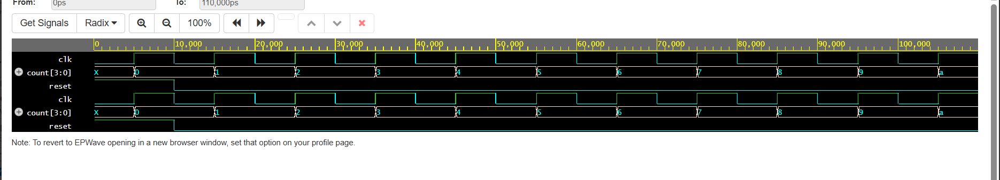

# 4-Bit Synchronous Counter using Verilog HDL

## Overview

This project implements a 4-bit synchronous up counter using Verilog HDL.

The counter changes its output on the rising edge of the clock. A reset input is used to initialize the counter to zero.

## Features

- 4-bit synchronous up counter
- Designed using Verilog HDL
- Positive-edge triggered clock
- Reset functionality
- Counts from 0 to 15
- Includes a Verilog testbench
- Simulated using Icarus Verilog
- Waveform verified using EPWave

## Working

The counter operates based on the rising edge of the clock signal.

When the reset signal is active, the counter is initialized to:

`0000`

When reset is inactive, the counter increments by one at every rising edge of the clock.

The counting sequence is:

`0000 → 0001 → 0010 → 0011 → ... → 1111`

After reaching `1111`, the counter rolls over to `0000`.

## Project Files

| File | Description |
|------|-------------|
| `counter_4bit.v` | Verilog RTL design of the 4-bit synchronous counter |
| `counter_4bit_tb.v` | Testbench used to verify the counter |
| `counter_waveform.png` | Simulation waveform showing the counter operation |

## Simulation

The design was simulated using **Icarus Verilog**.

The testbench generates the clock and reset signals and monitors the counter output.

### Simulation Waveform

The waveform shows the clock, reset, and 4-bit counter output during simulation.

## Tools & Technologies

- Verilog HDL
- Icarus Verilog
- EPWave
- RTL Design
- Digital Logic Design

## Learning Outcome

This project helped in understanding:

- Sequential logic design
- Synchronous counters
- Clocked `always` blocks
- Reset operation
- Verilog RTL coding
- Testbench development
- Simulation and waveform analysis

## Author

**Tavva Mohana Venkata Kavya**

ECE Student | Aspiring VLSI Engineer
